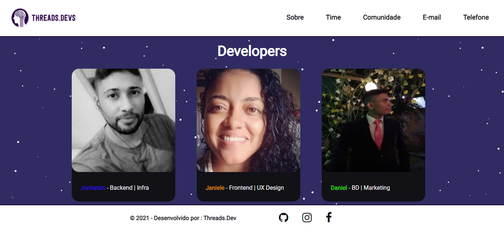

<h1 align="center"> Threads.Dev <h1>

<h1>  <h1>


# Indice
- [Sobre](#-sobre)
- [Tecnologias utilizadas](#-tecnologias-utilizadas)
- [Como baixar o projeto](#-como-baixar-o-projeto)

---

# 📋 Sobre
Página de apresentação dos desenvolvedores e projetos da threads.dev

---

## 🚀 Tecnologias utilizadas 

O projeto foi desenvolvido utilizando as seguintes tecnologias:

- [HTML](https://www.w3schools.com/html/)
- [CSS](https://www.w3schools.com/css/default.asp)
- [Javascript](https://www.w3schools.com/js/default.asp)

---

## 📁 Como baixar o projeto
```bash

    #Clonar repositório
    $ git clone https://github.com/JayGiG/threads

```

---
Desenvolvido por 👩‍💻 Janiele Nogueira